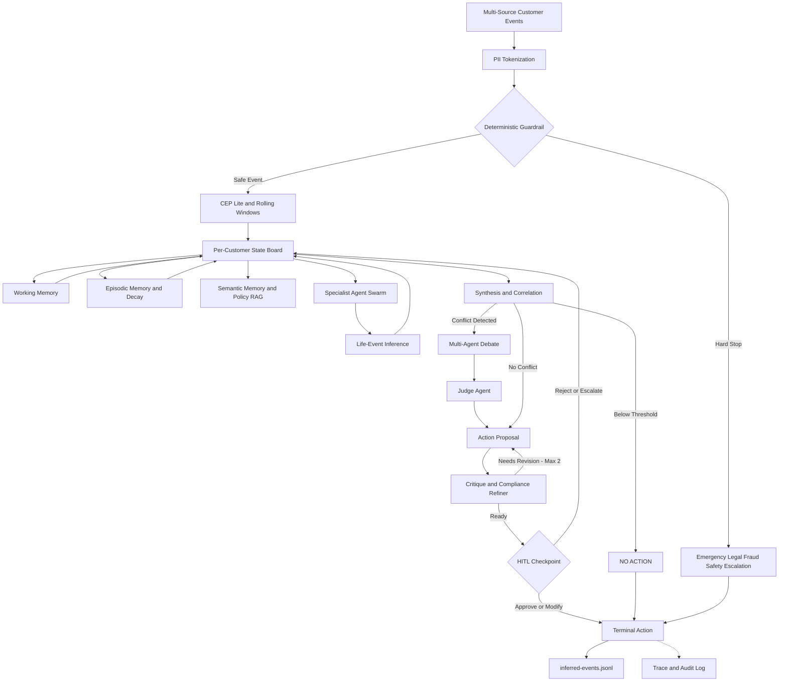

# Agentic Customer 360 - Proactive Intervention Desk

**Inter IIT Tech Meet 15.0 - Prepathon 2026 | IIT (BHU) Varanasi**  
**Track:** Natural Language Processing  
**Submission:** Mid-Term - Preliminary Research, System Architecture, and One-Page Approach Report

---

## 1. Problem Understanding

Traditional Customer 360 systems mainly aggregate customer information into dashboards. The PS requires a different approach: an ambient system that continuously processes customer events, maintains evolving customer context, detects meaningful changes, and decides whether an intervention is required.

The system must handle:

- Continuous, asynchronous, multi-source and potentially out-of-order events
- Event-based, time-based and agent-dependent triggers
- Persistent customer memory and evolving life-event state
- Specialized multi-agent reasoning
- Explicit coordination and disagreement resolution
- Real Human-in-the-Loop (HITL) approval for costly, sensitive or ambiguous actions
- Deterministic guardrails that can override agentic reasoning
- Traceability, provenance and explainability
- A falsifiable `inferred-events.jsonl` output containing customer state, confidence and action

The central objective is therefore not only to understand the customer, but to make a specific decision:

**What action should be taken now, or should the system explicitly take No Action?**

---

# 2. Proposed Architecture

We propose an **Event-Driven Ambient Multi-Agent Blackboard Architecture**.

The design separates deterministic safety and stream processing from non-deterministic agentic reasoning. It uses a governed per-customer state board, tripartite memory, stage-specific multi-agent coordination, bounded action generation, HITL approval and auditable outputs.

## 2.1 Flowchart



---

# 3. Architecture Components

## 3.1 Streaming and CEP

The prototype uses a Python-native asynchronous stream instead of requiring a full production Flink/Kafka deployment.

### Implementation approach

- Async event generator replays the provided event stream
- Events are processed continuously rather than as a one-shot batch
- Rolling windows maintain customer baselines and recent behavior
- Event-time ordering is used so late events do not corrupt window calculations
- New support/CRM records can be incrementally embedded into the vector store

### Example features

```text
login_frequency_7d
login_frequency_30d
transaction_velocity_1h
spend_variance_30d
sentiment_delta_7d
failed_transaction_count
```

The important architectural idea from CEP research is retained: raw event streams are filtered and transformed before expensive agentic reasoning.

---

## 3.2 Governed Per-Customer State Board and Memory

Every customer's working context is isolated using `customer_id`.

### Working Memory

Contains the current intervention cycle:

- Active trigger
- Current case
- Recent events
- Intermediate structured findings
- Current agent proposals

It is discarded or compacted once the case is resolved.

### Episodic Memory

Stores long-term customer-specific history:

- Past events
- Past risk flags
- Past interventions
- Customer responses
- Historical outcomes
- Life-event history

Historical records are retained, but their retrieval influence decreases with time.

### Decay Model

```text
A(m,t) = W_base * exp(-lambda * (t - t_event)) * (1 + R_reinforce)
```

Where:

- `A(m,t)` = retrieval activation
- `W_base` = base importance
- `lambda` = decay rate
- `t - t_event` = age of the memory
- `R_reinforce` = reinforcement from recurring evidence

An old churn flag therefore remains part of the history but does not automatically dominate a current decision.

### Semantic Memory

Contains cross-customer knowledge that is not personal customer history:

- Compliance policies
- Product rules
- Eligibility rules
- Margin limits
- Underwriting constraints

The semantic layer can be backed by ChromaDB for policy retrieval.

### State Board

The State Board is the controlled shared workspace between agents.

Agents publish structured conclusions such as:

```json
{
  "login_frequency_trend": -0.40,
  "sentiment_score": -0.81,
  "spend_variance": -0.15,
  "confidence": 0.91
}
```

Agents do not exchange unrestricted internal reasoning traces. Downstream agents receive scoped, structured findings.

---

# 4. Multi-Agent Coordination

The architecture does not use one coordination pattern everywhere. Each stage uses the topology that best fits its purpose.

| Stage | Coordination | Agents / Components | Output |
|---|---|---|---|
| Signal gathering | Swarm | Usage, Support, Transaction, KYC | Structured findings |
| Life-event inference | Agent-dependent trigger | Life-Event Agent | Life phase, confidence, evidence |
| Synthesis | Handoff | Synthesis Agent | Unified customer state |
| Conflict resolution | Debate + Judge | Competing perspectives + Judge | Winning strategy |
| Action generation | Handoff | Action Agent | Proposed intervention |
| Quality control | Critique-Refiner | Action + Critique Agent | Validated proposal |
| Safety | Deterministic | Guardrail layer | Hard-stop decision |

## 4.1 Specialist Agent Swarm

The initial signal-gathering agents run independently and publish structured results.

### Usage / Engagement Agent

Reads app and telemetry events.

Produces:

```json
{
  "login_trend_30d": -0.42,
  "session_dropoff_flag": true,
  "confidence": 0.91
}
```

### Support / Sentiment Agent

Reads support tickets, chats and CRM history.

Produces:

```json
{
  "ticket_urgency": "HIGH",
  "sentiment_score": -0.85,
  "churn_intent_flag": true
}
```

### Transaction / Billing Agent

Reads transaction and billing data.

Produces:

```json
{
  "spend_velocity_variance": -0.28,
  "failed_billing_count": 2,
  "confidence": 0.88
}
```

### KYC / Compliance Agent

Reads KYC and compliance records.

Produces:

```json
{
  "kyc_valid": true,
  "sanctions_match": false,
  "address_changed": true
}
```

The KYC agent is intentionally retained because the PS includes compliance/KYC as a specialized customer-signal source.

---

# 5. Life-Event Inference

The Life-Event Inference Agent is triggered by **agent-dependent conditions**, not every raw event.

Example:

```text
Transaction Agent
large deposit detected
        +
Usage Agent
home-loan activity detected
        +
KYC Agent
address changed
        |
        v
Life-Event Inference
        |
        v
Home Purchase with confidence score
```

The life phase is stored as persistent customer state so later decisions can reuse it instead of recomputing the customer's situation from scratch.

The inference is treated as a belief with supporting evidence, not as an unquestionable fact.

---

# 6. Synthesis, Debate and No Action

## 6.1 Synthesis / Correlation

The Synthesis Agent reads:

- Current State Board findings
- Relevant episodic memories
- Semantic policy knowledge
- Current life-event belief

It produces one coherent customer state.

Example:

```json
{
  "customer_state": "High churn risk with home finance opportunity",
  "arbitration_needed": true
}
```

## 6.2 Multi-Agent Debate

Debate is activated only when there is a genuine conflict.

Example:

```text
Retention perspective
        "Customer is showing churn signals"
                    VS
Growth perspective
        "Customer is showing expansion signals"
                    |
                    v
              Debate
                    |
                    v
                 Judge
                    |
                    v
          Winning strategy
```

The disagreement is made explicit rather than hidden inside a single aggregate score.

## 6.3 No Action Gate

If the evidence does not cross the action threshold:

```text
Synthesis
   |
   v
NO ACTION
   |
   v
Do not generate an unnecessary intervention
```

This prevents the system from forcing a recommendation when the correct answer is to wait.

---

# 7. Action Generation and Critique

## Action Agent

The Action Agent can propose only actions from the bounded PS action set.

It drafts:

- Action type
- Message or intervention summary
- Cost
- Eligibility conditions
- Supporting evidence

It does **not** directly execute customer-facing or costly actions.

## Critique / Compliance Agent

The proposal is checked against:

- Policy
- Eligibility
- Budget limits
- Customer sentiment
- Sensitive-inference rules
- Action constraints

Maximum refinement cycles:

```text
Action Proposal
      |
      v
Critique
      |
  Needs Fix?
   /     \
 Yes      No
 |         |
 v         v
Refine    HITL
 |
 +----> Maximum 2 iterations
```

**Why Critique-Refiner instead of Round Robin:** the PS describes Round Robin as useful for sequential drafting, but Critique-Refiner is more suitable here because the main requirement is a dedicated compliance, cost and grounding review before HITL.

---

# 8. Guardrails, RBAC and HITL

## 8.1 Deterministic Guardrails

Guardrails operate before normal agentic reasoning.

Examples:

```text
lawsuit
legal action
attorney
self-harm
suicide
sanctions hit
account takeover / fraud pattern
```

A hard-stop bypasses normal reasoning and sends the case to the appropriate escalation path.

The guardrail is intentionally deterministic so an LLM cannot reason around it.

## 8.2 PII and Data-Layer Access Control

Sensitive identifiers are tokenized before entering agent prompts.

Example:

```text
Raw customer identifier
        |
        v
CUST_TOKEN_8172
```

Data access is also scoped by role. For example, the Usage Agent should not have permission to query unrelated financial or brokerage tables.

## 8.3 Tool Blast Radius

Agents are given the minimum execution authority required for their role.

For example:

```text
Action Agent
    |
    +--> Can draft proposal
    |
    X--> Cannot send customer message
    X--> Cannot apply discount
    X--> Cannot modify account
```

Actual execution requires the appropriate authorization path.

## 8.4 Real HITL Checkpoint

HITL is implemented as an actual interruption in the workflow.

The reviewer can see:

- Proposed action
- Cost
- Confidence
- Evidence
- Source citations
- Trace ID
- Relevant customer history

The reviewer can:

```text
Approve
Modify
Reject
```

HITL is triggered not only by cost, but also by:

- Low confidence
- Unresolved agent disagreement
- Sensitive life-event inference
- Account restrictions
- Credit changes
- Other configured high-risk actions

---

# 9. Ambient Trigger Model

The system uses all three trigger types required by the PS.

| Trigger | Example |
|---|---|
| Event-based | New transaction, support ticket, KYC update |
| Time-based | Daily rollup, periodic health check, KYC re-verification |
| Agent-dependent | Life-event inference after correlated specialist findings |

This allows the system to respond both to immediate changes and to slow-building patterns.

---

# 10. Synchronous vs Asynchronous Execution

### Synchronous

Used for operations that must happen immediately.

```text
Incoming Event
      |
      v
PII Protection
      |
      v
Deterministic Guardrail
      |
      +----> Hard Stop / Escalation
      |
      v
Safe Event
```

### Asynchronous

Used for ambient background reasoning.

```text
CEP
 |
 +--> Swarm Agents
 |
 +--> Life-Event Inference
 |
 +--> Synthesis
 |
 +--> Debate
 |
 +--> Critique
 |
 +--> HITL Queue
```

This separation prevents slow generative reasoning from blocking safety-critical event handling.

---

# 11. Terminal Action Set

The system commits to exactly one terminal decision:

1. `No Action`
2. `Proactive Retention Outreach`
3. `Relationship-Manager Escalation`
4. `Personalized Offer`
5. `Support / Service Intervention`
6. `Compliance / Fraud Hold`

The terminal action is logged even when the result is `No Action`.

---

# 12. Required Output: inferred-events.jsonl

Every processed decision produces a timestamped structured record.

Example:

```json
{
  "timestamp": "2026-09-15T20:45:00Z",
  "customer_id": "CUST-9821",
  "inferred_life_phase": {
    "phase": "Home Purchase",
    "confidence": 0.88,
    "supporting_evidence": [
      "TX_ID_88192",
      "KYC_EVENT_102"
    ]
  },
  "current_churn_risk": {
    "score": 0.74,
    "primary_drivers": [
      "login frequency decay",
      "unresolved negative support ticket"
    ]
  },
  "decision": {
    "action": "Relationship-manager escalation",
    "is_costed": true
  },
  "hitl_status": {
    "required": true,
    "approval_state": "APPROVED"
  },
  "explainability": {
    "reasoning_path": "structured evidence -> synthesis -> arbitration -> action",
    "trace_id": "otel-span-..."
  }
}
```

The output is intended to support evaluation against hidden ground truth.

---

# 13. Research Log

The research was organized around the architectural questions that matter most to the PS:

- How should multi-agent systems coordinate?
- How should customer memory be structured and shared?
- How should old memories decay?
- How should continuous streams be processed?
- How should retrieval remain fresh?
- How should agent execution be traced?
- How should evolving customer state be represented?

## 13.1 Multi-Agent Debate

### Encouraging Divergent Thinking in Large Language Models through Multi-Agent Debate
**Tian Liang et al., EMNLP 2024**

Link: https://arxiv.org/abs/2305.19118

**What we learned**

Multiple agents can explicitly defend different hypotheses before an independent judge resolves the disagreement.

**Design decision**

Use **Multi-Agent Debate + Judge** only when customer signals create a genuine strategic conflict, such as retention versus expansion.

---

## 13.2 Multi-Agent Reflection and Critique

### Agentic Workflows for Improving Large Language Model Reasoning in Robotic Object-Centered Planning
**Jesus Moncada-Ramirez et al., Robotics, 2025**

Link: https://doi.org/10.3390/robotics14030024

**What we learned**

Planner-feedback-refinement workflows can improve outputs, but excessive reflection can be harmful when the correct result is a null response.

**Design decision**

Use a **Critique-Refiner loop with a bounded iteration count** and an explicit **No Action gate** before unnecessary generation.

---

## 13.3 Governed Shared Memory

### Governed Shared Memory for Multi-Agent LLM Systems
**2026**

Link: https://arxiv.org/abs/2606.24535

**What we learned**

Shared state in multi-agent systems needs isolation, scoped access and provenance.

**Design decision**

Use a **Governed Shared Per-Customer State Board** where agents publish structured findings instead of unrestricted internal context.

---

## 13.4 Tripartite Agent Memory

### MemMachine: A Ground-Truth-Preserving Memory System for Personalized AI Agents
**John Lavoie, Ashish Rana et al., 2026**

Link: https://arxiv.org/abs/2604.04853

**What we learned**

Working, episodic and semantic memory serve different roles. Preserving raw historical evidence is important for provenance.

**Design decision**

Use:

```text
Working Memory
Episodic Memory
Semantic Memory
+
Governed State Board
```

---

## 13.5 Memory Decay

### Oblivion: Self-Adaptive Agentic Memory Control through Decay-Driven Activation
**Ashish Yao et al., 2026**

Link: https://arxiv.org/abs/2604.00131

**What we learned**

Memories can become less accessible over time without being deleted.

**Design decision**

Use **decay-weighted episodic retrieval** so historical signals such as an old churn flag remain preserved but do not automatically dominate new decisions.

---

## 13.6 Complex Event Processing

### Flink CEP and Agentic AI: Real-Time Pattern Detection as the Foundation for Autonomous Decisions
**Kai Waehner, 2026**

Link: https://www.kai-waehner.de/blog/2026/04/28/flink-cep-and-agentic-ai-real-time-pattern-detection-as-the-foundation-for-autonomous-decisions/

**What we learned**

Continuous event streams can be filtered and transformed into meaningful patterns before invoking expensive reasoning.

**Design decision**

Use **CEP-lite in Python** with rolling windows and composite triggers instead of requiring full production Flink infrastructure for the prototype.

---

## 13.7 Real-Time RAG

### Real-Time RAG: Streaming Vector Embeddings and Low-Latency AI Search
**Ganesh Bushnam, Striim, 2024**

Link: https://www.striim.com/blog/real-time-rag-streaming-vector-embeddings-and-low-latency-ai-search/

**What we learned**

CDC-driven incremental updates can keep retrieval synchronized with changing data.

**Design decision**

Use **incremental embedding updates** for newly arriving support/CRM information rather than relying only on periodic full re-indexing.

---

## 13.8 Provenance and Agent Tracing

### From Agent Traces to Trust: Evidence Tracing and Execution Provenance in LLM Agents
**Hendrik Strobelt et al., 2026**

Link: https://arxiv.org/abs/2606.04990

**What we learned**

Agent executions can be represented as traceable chains covering retrieval, tool calls and intermediate execution steps.

**Design decision**

Attach a **trace ID and provenance information** to final decisions so the human reviewer can inspect the evidence path.

---

## 13.9 Latent Customer State

### ComBodied Agents: A New Paradigm of Human-Centric Agentic AI
**Qianggang Ding et al., 2026**

Link: https://arxiv.org/abs/2608.10915

**What we learned**

A user's state can be represented as an evolving latent belief updated from multiple observations over time.

**Design decision**

Use a **persistent Life-Event Inference Agent** that updates the customer's life-phase belief as new evidence arrives.

---

# 14. Closest Existing Approaches to the PS

We reviewed existing solutions to understand which approaches are closest to the PS and where our architecture extends them.

| Closest approach | What matches the PS | What our design adds |
|---|---|---|
| **BUSINESSNEXT / AGENTNEXT** | Customer 360, real-time signals, ambient/event-driven orchestration and next-best-action | More explicit tripartite memory, customer-scoped state, memory decay and structured arbitration |
| **Zensar Predictive AI Customer 360** | Specialist agents, supervisor/synthesis architecture, confidence and human review | Persistent life-state tracking, decay-aware memory and explicit debate/critique stages |
| **Ventus AI** | Transaction behavior, life-event detection, evidence and confidence | Integration into a governed multi-agent runtime with shared state, guardrails and HITL |
| **Multi-Agent Debate research** | Explicit disagreement and arbitration | Applied to Customer 360 business-goal conflicts |
| **Agent memory research** | Separate temporal memory roles and memory lifecycle | Combined into one governed per-customer memory model |
| **Streaming / CEP research** | Continuous event processing and windowed detection | Combined with ambient agent triggers and retrieval freshness |
| **Provenance research** | Traceable agent/tool/retrieval execution | Integrated into the final decision and HITL review path |

### Research conclusion

The closest existing approaches already demonstrate individual capabilities required by the PS. Our focus is not to claim that each component is new.

The proposed contribution is the **composition of these capabilities into one governed ambient workflow**:

```text
Continuous Event Stream
        |
        v
PII + Deterministic Guardrails
        |
        v
CEP and Rolling Features
        |
        v
Governed Tripartite Memory
        |
        v
Specialist Agent Swarm
        |
        v
Life-Event State
        |
        v
Synthesis and Debate
        |
        v
Bounded Action
        |
        v
Critique
        |
        v
HITL
        |
        v
Audited Terminal Decision
```

---

# 15. PS Requirement to Architecture Mapping

| PS Requirement | Architecture Response |
|---|---|
| Continuous event stream | Async event generator and continuous processing |
| Multi-source data | App, transactions, support, KYC |
| Out-of-order handling | Event-time ordering and timestamp buffering |
| Live transforms | Rolling windows and online features |
| Live retrieval | Incremental vector updates |
| Ambient agents | Event, time and agent-dependent triggers |
| Agent memory | Working, episodic and semantic memory |
| Memory expiry | Decay-weighted episodic retrieval |
| Customer isolation | `customer_id` scoped State Board and memory |
| Specialized agents | Distinct agents with scoped tools/data |
| Explicit handoffs | Structured findings between stages |
| Disagreement resolution | Debate + Judge |
| Null decision | Explicit No Action gate |
| Real HITL | Workflow interruption with approval controls |
| Ambiguity escalation | Low confidence and unresolved conflict to human |
| Deterministic guardrails | Pre-LLM hard-stop layer |
| PII protection | Tokenization and pseudonymization |
| Bounded tools | Role-based access and restricted action permissions |
| Explainability | Evidence + provenance + trace ID |
| Traceability | Agent/tool/retrieval logging |
| Falsifiable output | `inferred-events.jsonl` |
| Evaluation | Ground-truth comparison harness |

---

# 16. Known Tradeoffs and Limitations

### Complexity versus buildability

A fully production-scale implementation would require distributed infrastructure such as Kafka, Flink and a dedicated observability stack. The prototype uses lightweight substitutes so that the agentic behavior itself can be demonstrated.

### Debate latency

Debate is more expensive than a single synthesis pass, so it is activated only for genuine conflicts.

### Memory decay

Aggressive decay could suppress useful historical context. Reinforcement and explicit evidence importance are therefore used to make recurring patterns more retrievable.

### Life-event inference uncertainty

A life event is probabilistic. Sensitive or low-confidence inferences should not automatically trigger customer-facing actions.

### LLM non-determinism

The architecture reduces the consequences of model errors through typed outputs, bounded action space, deterministic guardrails, restricted tools and HITL.

### Prototype versus production

The prototype demonstrates the required semantics and end-to-end behavior. A production deployment would require stronger distributed storage, authentication, monitoring, fault tolerance and compliance controls.

---

# 17. Mid-Term Findings and Proposed Approach

The research led to four main architectural conclusions:

1. **Streaming must be first-class.** Customer 360 requires continuous event processing rather than passive batch dashboards.
2. **Memory must be structured and time-aware.** Working context, historical evidence and shared policy knowledge have different lifecycles.
3. **Multi-agent coordination should be stage-specific.** Swarm, handoff, debate and critique-refiner serve different roles.
4. **Autonomy must be bounded.** Deterministic guardrails, restricted tools, explicit No Action states and HITL are required before real intervention.

### Proposed Approach

```text
Event
  |
  v
PII + Safety Check
  |
  v
CEP / Rolling Features
  |
  v
Per-Customer Memory + State Board
  |
  v
Specialist Agent Swarm
  |
  v
Life-Event State
  |
  v
Synthesis
  |
  +------> No Action
  |
  +------> Debate + Judge
               |
               v
         Action Proposal
               |
               v
            Critique
               |
               v
              HITL
               |
               v
        Terminal Action
               |
               v
     inferred-events.jsonl
```

For the required one-page submission artifact, see **[One-Page Approach Report](./one_page_approach_report.pdf)**.


## Submission Artifacts

- [System Architecture Diagram](./architecture_diagram.png)
- [One-Page Approach Report](./one_page_approach_report.pdf)
